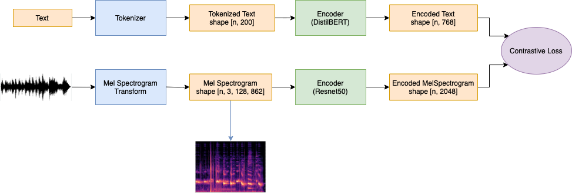
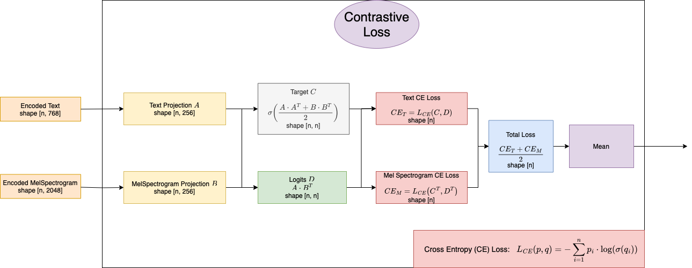

# CMTP
Contrastive Music-Text Pre-Training (CMTP) is a model that has learnt relationships between music and text, enabling fully zero-shot retrieval of music based on natural language prompts and vice versa.  

As an example, after training, the model was given a completely new and unlabeled set of ~1000 audio files ([GTZAN](https://www.kaggle.com/datasets/andradaolteanu/gtzan-dataset-music-genre-classification) dataset) to act as a database of known music. Next, the model was given the prompt `a slow, haunting melody` and returned [this](https://github.com/deetsadi/CMTP/assets/47929718/f8e26155-d296-4a0c-96d9-c04499af3347)  as the strongest match within the dataset.  

Similarily, the prompt `female singer over keyboard and soft drums` was used and the model returned [this](https://github.com/deetsadi/CMTP/assets/47929718/f45dbffa-ae27-414f-9b46-17a3e6d4e292) as the best result.  

Inspired by CLIP from OpenAI, CMTP was trained using (music, text) pairs from the [MusicCaps](https://research.google/resources/datasets/musiccaps/) dataset.  
A detailed look at the model architecture is shown below:  

Further, the contrastive loss is shown more in depth:

## Usage
### Dataset
Download the MusicCaps dataset, including both the raw audio files and csv containing metadata. Use the script located [here](https://github.com/nateraw/download-musiccaps-dataset) to do so.
### Train
Call `train.py` with your desired hyperparameters.
